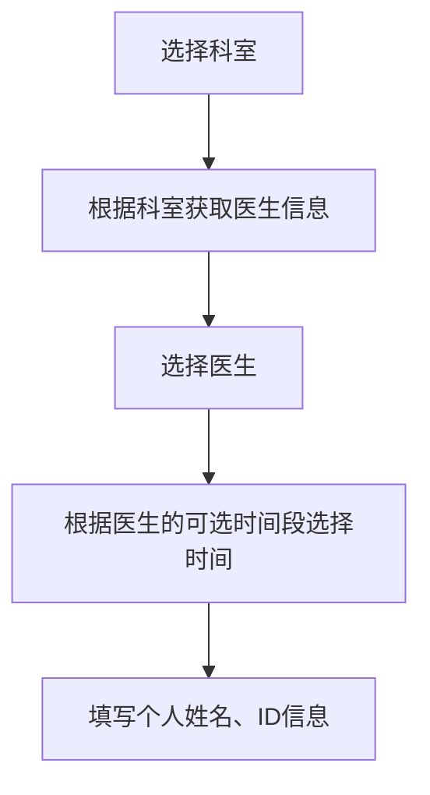

# 与后端交互的部分

## Patient

### Doctor List

需要从后端获取所有医生的ID、姓名、科室信息

```c
doctors = [
        { id: 1, name: '张医生', specialty: '内科' },
        { id: 2, name: '李医生', specialty: '外科' },
        { id: 3, name: '王医生', specialty: '儿科' }
        ...
    ];
```

无需向后端返回信息

现仅实现所有医生的罗列，后期可添加根据科室、姓名筛选医生的功能

### Booking Process



后端需要根据选定科室提供科室内医生的所有信息包括可选时间段

```c
doctors = [
        { id: 1, name: '张医生', specialty: '内科' ,timelist: ['09:00', '10:00', '11:00']},
        { id: 2, name: '李医生', specialty: '外科' ,timelist: ['08:30', '09:30', '14:00'] },
        { id: 3, name: '王医生', specialty: '儿科' ,timelist: ['10:15', '11:15', '15:00'] }
    ];
```

向后端提交预约信息

后端收到预约信息后，需发送一个响应阐明接收情况。

```c
formData = {
        patientName: patientName,
        patientID: patientID,
        selectedDepartment: selectedDepartment,
        selectedDoctor: selectedDoctor,
        selectedTime: selectedTime
    }
fetch('/submit-appointment', {
             method: 'POST',
             body: JSON.stringify(formData),
         })
```

### Patient Center

前端发送患者ID

后端根据患者ID获得患者预约记录数据，并发送至前端。

```c
bookings = [
        { id: 1, doctorName: '张医生', specialty: '内科', date: '2024-06-10', time: '09:00' },
        { id: 2, doctorName: '李医生', specialty: '外科', date: '2024-06-15', time: '14:00' }
    ];
```